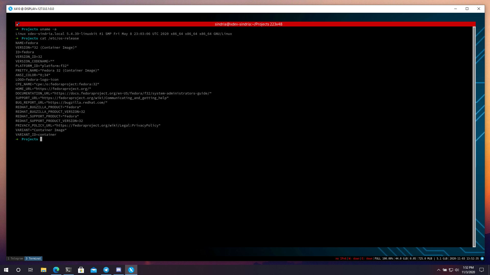

# Xdev

Xdev is the first cloud native distro made for developers.

You can run Xdev everywhere you have docker daemon running.

Demo link: [http://demo-xdev.sindria.org:8080](http://demo-xdev.sindria.org:8080)

Password: `sindria`

## Tutorial

- Move terminal to workspace 3: `ALT + SHIFT + 3`

- Open browser on workspace 1: `ALT + D` -> type: firefox-developer -> `ENTER`

- Move to workspace 2: `ALT + 2`

- Open PhpStorm: `ALT + D` -> type: phpstorm -> `ENTER`

- Move to workspace 3: `ALT + 3`

- Close window: `ALT + SHIFT + Q`

## Information

With xdev you have complete linux workstation ready out of the box with the following contents:

- Fedora 34
- Oh My Zsh
- Git Sindria
- Tmate
- Asciinema
- Pandoc
- Docker
- Docker Compose
- Kubectl
- Lens
- Telegram Desktop
- Firefox Developer
- Terminator
- Flux
- Sublime Text
- Mysql WorkBench
- PhpStorm
- PyCharm
- IntelliJ Idea
- WebStorm
- RubyMine
- GoLand
- Clion
- DataGrip
- I3 WM

## Requirements

- Docker CE
- Docker Compose
- Xorg

## Setup

[comment]: <> (### Quick install)

[comment]: <> (- Run: `docker-compose -f https://raw.githubusercontent.com/SindriaInc/xdev/master/deployment/docker-compose.example.yml --env-file https://raw.githubusercontent.com/SindriaInc/xdev/master/deployment/.env.example up -d`)

### Standard install

- On your host make a directory
- Go to under deployment folder in this repo
- Setup file env: `cp .env.example .env`
- Setup Docker Compose `cp docker-compose.example.yml docker-compose.yml`
- Run: `docker-compose up -d`

# License

This software is release open source under [GPL](https://github.com/SindriaInc/xdev/blob/master/LICENSE) license.
